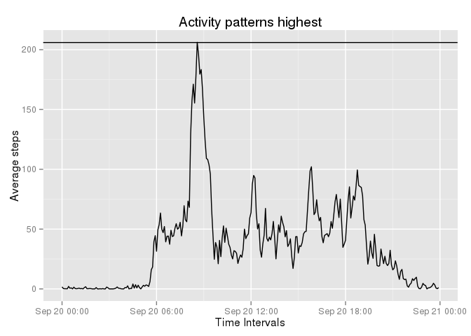

# Reproducible Research: Peer Assessment 1


## Loading and preprocessing the data

###Load data

```r
#Assume have set working directory
#Download and unzip file
zipFile<-"https://d396qusza40orc.cloudfront.net/repdata%2Fdata%2Factivity.zip"
destFile="assign1_Dataset.zip"
if(!file.exists(destFile)) {
  download.file(zipFile,destFile,method="curl")
}
unzip(destFile,overwrite=TRUE)


#Load file
dataFile<-"activity.csv"
activityData<-read.table(dataFile,sep=",",header=TRUE,stringsAsFactors = FALSE,na.strings = "?")
```

###Process data


```r
#Dates, convert date, and create date description and extract day of week
activityData$date2 = as.Date(activityData$date)
activityData$dateDesc = format(activityData$date2, "%d %b %Y") 
activityData$DOW = weekdays(activityData$date2) 

#Times, handle values 2350 as 23:50
activityData$interval2  <- as.POSIXct(sprintf("%04d", activityData$interval), format="%H%M")
activityData$interval3  <- format(strptime(sprintf("%04d", activityData$interval), format="%H%M"),format = "%H:%M")
```


## What is mean total number of steps taken per day?

###Filter  data

```r
library(sqldf)

#Subset data 
stepsData <- sqldf('select date2, dateDesc, DOW, sum(steps) as totSteps
                   from activityData 
                   where steps <> "NA" 
                   group by date2, dateDesc, DOW 
                   order by date2')
```

###Plot data

```r
library(ggplot2)

meanSteps <-round(mean(stepsData$totSteps),digits = 0)
medianSteps <-round(median(stepsData$totSteps),digits = 0)

ggplot(stepsData, 
   aes(x = date2, 
      y = totSteps, 
      fill=DOW)
  ) + 
  geom_histogram(stat = "identity") + 
  geom_hline(aes(yintercept=medianSteps)) +
  geom_hline(aes(yintercept=meanSteps)) +
  ggtitle(paste0("Average steps taken per day  mean - ",meanSteps," | median: ", medianSteps)) +
  ylab("Total steps") +
  xlab("Date") 
```

 

## What is the average daily activity pattern?

###Filter  data

```r
intervalData <- sqldf(
    ' select interval2, sum(steps) as totSteps, avg(steps) as avgSteps 
      from activityData 
      where steps <> "NA" 
      group by interval2 
      having totSteps > 0 
    ')
```

###Plot data 

```r
#Filter data
intervalData <- sqldf('select interval2, avg(steps) as avgSteps 
                      from activityData where steps <> "NA" 
                      group by interval2')
maxSteps<-round(max(intervalData$avgSteps),digits=0)

#Interval with highest number of steps
maxInterval<-substring((summary(intervalData)[6]),20,24)

#Plot
ggplot(intervalData, 
  aes( x = interval2,
  y = avgSteps)
) +
  geom_line(stat = "identity") +
  geom_hline(aes(yintercept=maxSteps)) +
  ggtitle(paste0("Activity patterns highest")) +
  ylab("Average steps") +
  xlab("Time Intervals")
```

 

The interval with the highest number of steps is: **23:55 pm**


## Imputing missing values

```r
#dataset with NAs
naData<-sqldf('select * from activityData where steps="NA"')
naRows<-nrow(naData)
```
#####The total number of missing values in the dataset, the total number of rows with NAs is: **2304**


```r
#Calculate average data for non NA values
meanData<-sqldf('select avg(steps) as AvgSteps
                  , DOW, interval 
                from activityData 
                where steps<>"NA" 
                group by DOW, interval')

#Create a new dataset that is equal to the original dataset but with the missing data filled in
library(dplyr)
activityDS<-merge(activityData,meanData,by.x=c("interval","DOW"),by.y=c("interval","DOW"),all=TRUE)

#Populate NA values
activityDS$imputeSteps<-ifelse(activityDS$steps=="NA",activityDS$AvgSteps,activityDS$steps)
```

### Plot data

```r
#Summarise using dataset with imputed values
stepsData2 <- sqldf('select date2, dateDesc, DOW, sum(imputeSteps) as totSteps
                   from activityDS 
                   group by date2, dateDesc, DOW 
                   order by date2')

meanSteps2 <-round(mean(stepsData2$totSteps),digits = 0)
medianSteps2 <-round(median(stepsData2$totSteps),digits = 0)

ggplot(stepsData2, 
   aes(x = date2, 
      y = totSteps, 
      fill=DOW)
  ) + 
  geom_histogram(stat = "identity") + 
  geom_hline(aes(yintercept=medianSteps2)) +
  geom_hline(aes(yintercept=meanSteps2)) +
  ggtitle(paste0("Average steps taken per day  mean - ",meanSteps2," | median: ", medianSteps2)) +
  ylab("Total steps") +
  xlab("Date") 
```

 

Compared to the earlier graph with NAs excluded, this histogram shows:

  + the mean and median values have changed
    + Mean increased by **55** steps
    + Median increased by **250** steps
  + there is a larger gap of **194** steps between the mean and median values


## Are there differences in activity patterns between weekdays and weekends?


```r
#Classify as weekend
activityDS$dayType<-ifelse(activityDS$DOW %in% c("Sunday","Saturday"),"Weekend","Weekday")

#Summarise data
dayData <-sqldf('select dayType, interval2, Avg(imputeSteps) as avgSteps 
                 from activityDS 
                 group by dayType, interval2')


#Plot data 
ggplot(dayData, 
       aes( x = interval2,
            y = avgSteps)
) +
  geom_line(stat = "identity", colour = "blue") +
  ggtitle(paste0("Activity patterns by day type")) +
  ylab("Number of steps") +
  xlab("Interval")+ 
  facet_wrap( ~ dayType, nrow = 2)
```

 

The highest average steps taken at a single interval, are on a ***weekday***.
